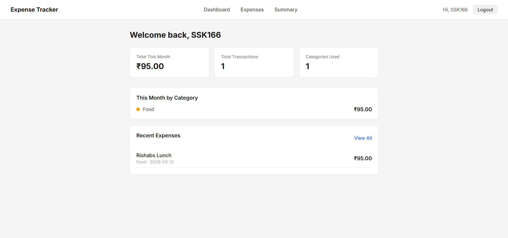
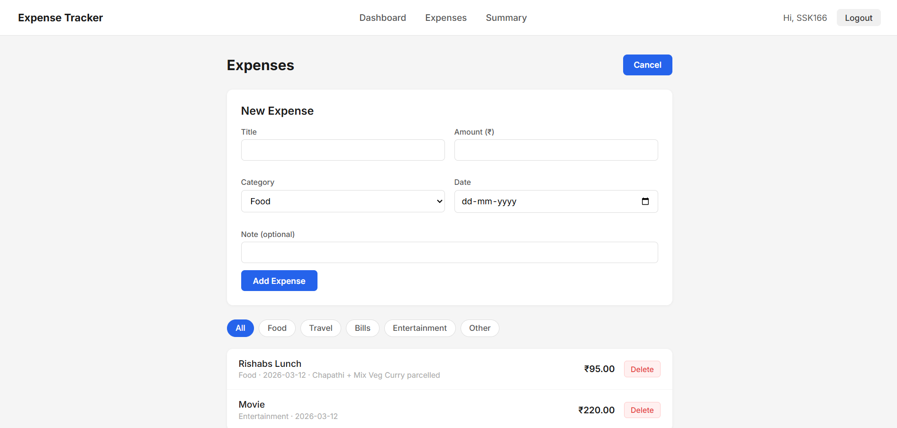
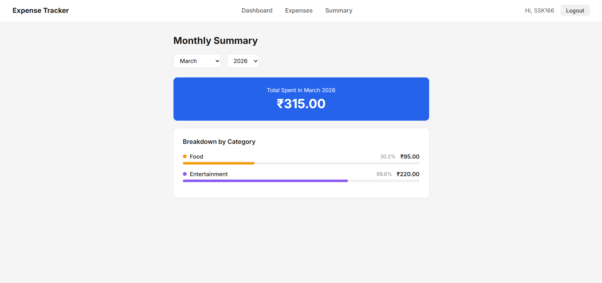

# Expense Tracker

A full stack expense tracking web application built with React and Spring Boot.


---

## Screenshots





---

## Features

-  User registration and login with JWT authentication
-  Add expenses with title, amount, category, date and note
-  Filter expenses by category (Food, Travel, Bills, Entertainment, Other)
-  Delete expenses
-  Monthly summary with total spent per category and visual progress bars
-  Clean, minimal UI — no unnecessary clutter

---

## Tech Stack

| Layer | Technology |
|-------|------------|
| Frontend | React 18, React Router, Axios |
| Backend | Spring Boot 3.2, Spring Security |
| Auth | JWT (JSON Web Tokens) |
| Database | MongoDB |
| Build Tool | Maven, Vite |

---

## Project Structure

```
expense-tracker/
├── backend/                  # Spring Boot REST API
│   └── src/main/java/com/expense/
│       ├── controller/       # REST endpoints
│       ├── service/          # Business logic
│       ├── entity/           # MongoDB documents
│       ├── repository/       # MongoRepository interfaces
│       ├── security/         # JWT filter and utility
│       └── config/           # Spring Security config
└── frontend/                 # React app
    └── src/
        ├── pages/            # Dashboard, Expenses, Summary, Login, Register
        ├── components/       # Navbar
        ├── context/          # Auth context (useContext)
        └── api/              # Axios instance with JWT interceptor
```

---

## Setup & Running Locally

### Prerequisites
- Java 21
- Node.js 18+
- MongoDB running locally

### 1. Clone the repository
```bash
git clone https://github.com/YOURUSERNAME/expense-tracker.git
cd expense-tracker
```

### 2. Backend Setup

Copy the example properties file and fill in your values:
```bash
cp src/main/resources/application.properties.example src/main/resources/application.properties
```

`application.properties`:
```properties
spring.data.mongodb.uri=mongodb://localhost:27017/expense_tracker
jwt.secret=your-secret-key-here
jwt.expiration=86400000
server.port=8080
spring.web.cors.allowed-origins=http://localhost:5173
```

Start MongoDB:
```bash
mongod
```

Run the backend from IntelliJ or:
```bash
cd backend
mvn spring-boot:run
```

### 3. Frontend Setup
```bash
cd frontend
npm install
npm run dev
```

App runs at **http://localhost:5173**

---

## API Endpoints

| Method | Endpoint | Auth | Description |
|--------|----------|------|-------------|
| POST | `/api/auth/register` | No | Register new user |
| POST | `/api/auth/login` | No | Login and receive JWT |
| GET | `/api/expenses` | Yes | Get all expenses |
| POST | `/api/expenses` | Yes | Add new expense |
| DELETE | `/api/expenses/{id}` | Yes | Delete expense |
| GET | `/api/expenses/category/{cat}` | Yes | Filter by category |
| GET | `/api/expenses/summary` | Yes | Monthly summary |
